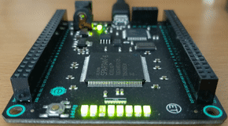

# Silice

Silice aims at simplifying writing code for FPGAs. It compiles to and inter-operates with Verilog. Silice is not meant to hide the HDL complexity, but rather to complement it, making it more enjoyable to write parallel code and algorithms utilizing the FPGA architecture. 

### A first example:

Code:
```c
algorithm main(output uint8 led) {   
  uint28 counter = 0;      // a 28 bits unsigned integer
  led := counter[20,8];    // LEDs track the 8 most significant bits  
  while (1) {              // forever
    counter = counter + 1; // increment counter
  }  
}
```

Compile:
```
silice first_example.ice -f frameworks/mojo_led.v -o Mojo-Project/src/mojo_top.v
```

Enjoy!



## Principle

Silice does not attempt to abstract away the hardware: the programmer remains in control and very close to hardware features. However, Silice makes it much easier to reason in terms of execution flow and operation sequences than when using Verilog directly. But when Verilog makes more sense, simply import Verilog directly into Silice!

Silice is reminiscent of high performance programming in the late 90s (in the demo scene in particular): the then considered high-level C language was commonly interfaced with time-critical ASM routines. This enabled a best-of-both-worlds situation, with C being used for the overall program flow and ASM used only on carefully optimized hardware dependent routines.

Silice does the same, providing a programmer friendly C-inspired layer on top of Verilog, while allowing to call low level Verilog modules whenever needed. Silice also favors parallelism and performance everywhere, allowing to fully benefits from the specificities of FPGA architectures.

